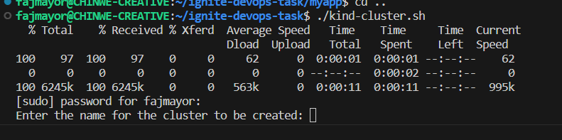
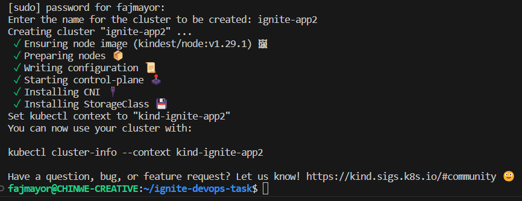
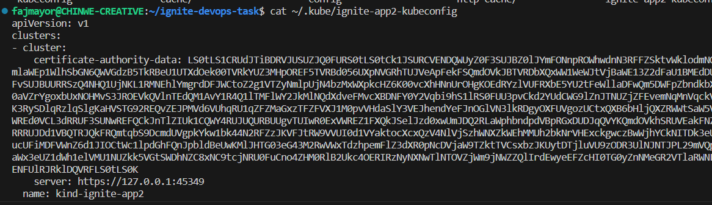

# Ignitedotdev Devops Task Solution

## Set up a Kubernetes Cluster using KIND

Run `kind-cluster.sh` from your terminal to deploy KIND cluster.

- The script checks if Docker is installed and running on the system. If Docker is not installed or not running, it mandates you to install Docker before it can run successfully.
- The script installs `kubectl` if not available.
- The script examines the architecture of your Linux system to determine the KIND cluster to install.
- It prompts you to enter the name of the cluster.

    

- If the cluster is successfully cretaed, it download and saves the kubeconfig file in `~/.kube`.

    

    

## Deploy a sample Node.js app using terraform
1. The `myapp` directory contains `hello world` express Node.js files, including `index.js`, `package.json`, `package-lock.json`, and its `Dockerfile`.

    #### Build the Dockerfile using `docker build` and push the image to Dockerhub

2. The `manifests` directory contains the Kubernetes deployment manifest file `ignite-deployment.yaml` to deploy the Node.js application to the KIND cluster.

3. `main.tf` contains the Terraform code to deploy the manifest into the KIND cluster using the `kubectl` Terraform provider.

    #### NB: Change the provider config_path value to reflect your kubeconfigure name.

4. Also, `main.tf` includes the resource blocks for monitoring and observability for the Prometheus cluster using the `kube-prometheus stack` and the Terraform Helm provider.

To deploy the Node.js app, Ensure to `cd myapp` and enter `terraform apply`